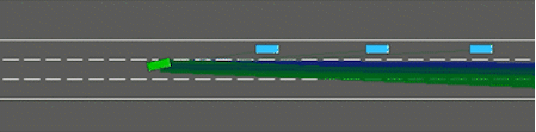
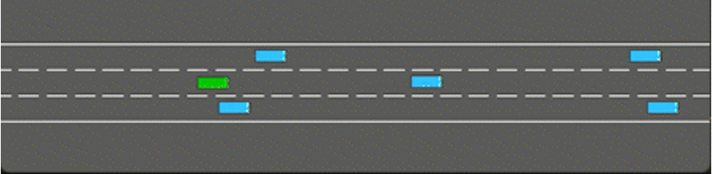
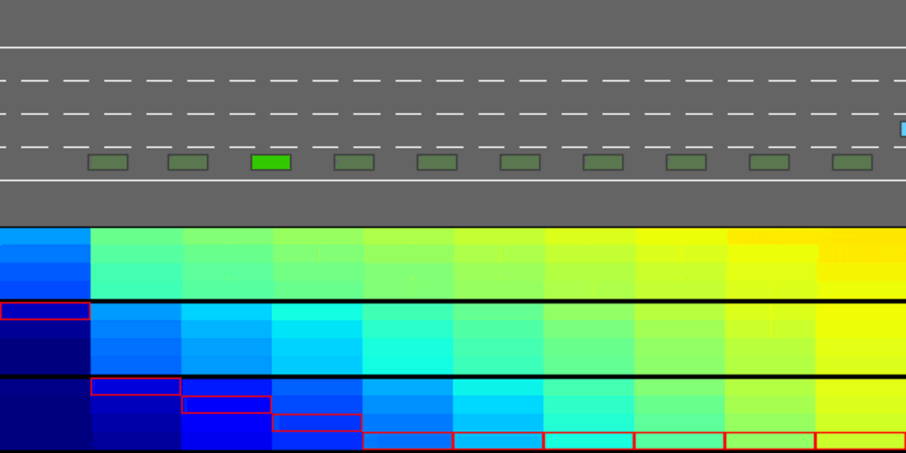

# Highway-Decision-Transformer
Decision Transformer for offline single-agent autonomous highway driving.

## Code Structure
```
.
├── README.md
├── modules # all model modules contained here
│   ├── __init__.py
├── pipelines # all training, testing, preprocessing, and data gathering pipelines contained here
│   ├── __init__.py
├── expert_scripts # all expert data collection contained here
├── example-notebooks # scartch/example jupyternotebooks
├── experiments # all training, testing, and demo experiment files for various models
```

## Environment
We used the open source [```highway-env```](https://highway-env.readthedocs.io/en/latest/ "highway-env") Python framework to simulate a highway environment. highway-env is built on top of the [OpenAI Gym toolkit](https://github.com/openai/gym), which is widely used in the field of reinforcement learning. ```highway-env``` provides a customizable and modular framework for designing experiments related to highway traffic, such as vehicle dynamics, traffic flow, and behavior modeling. It also includes various metrics and evaluation tools to assess the performance of different agents in the simulated environment. In our experiment, we will focus on a class of highway-env instance, consisting of 3 lanes and 20 other simulated cars. Our goal is to train an agent to drive safely in this scenario and maximize the default ```highway-env``` reward:

<p align="center">
$R(s,a) = a \frac{v - v_{min}}{v_{max} - v_{min}} - b \text{collision}$
</p>

where $v$, $v_{min}$, and $v_{max}$ are the current, minimum, and maximum speed of the ego-vehicle respectively and $a$ and $b$ are coefficients.

## Data Collection
Three online RL methods were used to collect expert data: Proximal Policy Optimization (PPO), Deep Q-Network (DQN), and Monte Carlo Tree Search (MCTS). The scripts to collect data can be found in [```/expert_scripts```](/expert_scripts).

Below is a demonstration of the performance of the various experts. PPO and DQN are highly popular, state-of-the-art online RL methods while MCTS completely searches the game tree at each iteration and thus always finds the maximum reward/best move.

### [Proximal Policy Optimization (PPO)](/expert_scripts/ppo_highway.py)
<p align="center">

</p>

### [Deep Q-Network (DQN)](/expert_scripts/dqn_highway.py)
<p align="center">

</p>

### [Monte Carlo Tree Search (MCTS)](/expert_scripts/mtcs_highway.py)
<p align="center">

</p>

## Models
### [Benchmark: Behaviour Cloning](/modules/behaviour_cloning.py)

This is one of two benchmark models used by the original DT paper. By following an imitation-learning approach, we developed an agent to mimic the behaviours of the expert on which it is trained on.

### Benchmark: Conservative Q-Learning

The is the state-of-the-art offline RL method. It uses a temporal difference learning approach.

### [Baseline Decision Transformer](/modules/decision_transformer.py)

Several experiments with various configurations of training datasets and parameters have been conducted in [```/experiments/```](/experiments).

The DT model is based on GPT-2 defined in [```/modules/trajectory_gpt2.py```](/modules/trajectory_gpt2.py).

### Decision Transformer with Different Encoders
We used two embeddings 

1. Kinematics: We used a 5x5 array of the position and velocities of the nearest 5 vehicles. 
2. Image-Based: We used 4 of the most recent grayscale birdseye view images. 

### LSTM

LSTM is a type of recurrent neural network (RNN) that is classically used for sequence modelling problems. A common criticism of DTs is that they are no different than sequence modelling with RNNs. We plan on replacing DT blocks with LSTM blocks to verify whether this criticism holds.

## Result

### Decision Transformer on Kinematic Input (best 42.19 mean reward)
<p align="center">

</p>


### Decision Tranformer on Grayscale Image Input (best 61.39 mean reward)
<p align="center">

</p>
